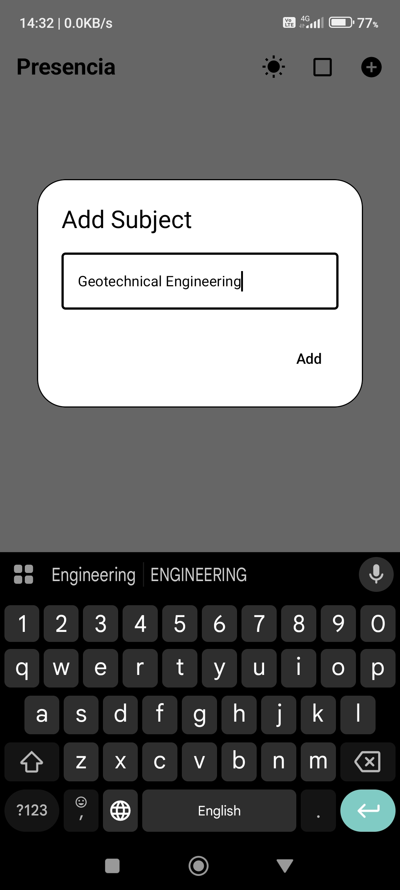
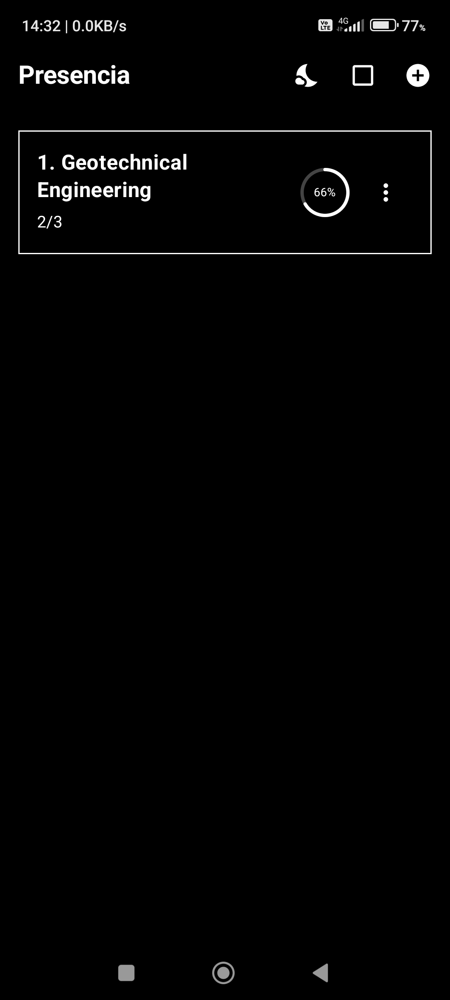
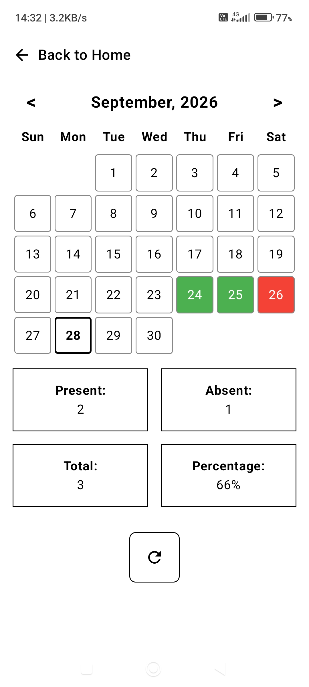

<h1 align="center">Presencia</h1>

  A simple, modern and offline attendance tracking app for Android.

      

---

## About

**Presencia** is a simple and modern Android application designed to help students easily record, manage and monitor their class attendance subject by subject.

The application provides a calendar-based interface for recording attendance on individual dates and automatically calculating attendance statistics.

Presencia works completely **offline**, with attendance data stored locally on the device. No account, internet connection or cloud service is required.

---

## Features

- Add subjects with custom names
- Edit existing subject names
- Delete subjects
- Mark individual class dates as Present or Absent
- View attendance records through a monthly calendar
- Easily identify attendance status using color indicators
- View Present, Absent and Total class counts
- Automatic attendance percentage calculation
- Light and Dark theme support
- Completely offline
- Local device storage
- No login or account required
- No cloud synchronization required

---

## Screenshots

### Add Subject

  

### Home Screen

  

### Attendance Calendar

  

---

## Attendance Tracking

Presencia uses a simple color-based system to represent attendance on the calendar.

| Color | Meaning |
|---|---|
| 🟩 Green | Present |
| 🟥 Red | Absent |
| ⬜ Unmarked | No attendance recorded |

This makes it easy to identify attendance patterns directly from the calendar.

---

## Attendance Statistics

For every subject, Presencia displays:

- **Present** — Number of classes attended
- **Absent** — Number of classes missed
- **Total** — Total classes recorded
- **Percentage** — Overall attendance percentage

### Formula

    Attendance Percentage = (Present Classes / Total Classes) × 100

Where:

    Total Classes = Present Classes + Absent Classes

### Example

    Present = 2
    Absent  = 1
    Total   = 3

    Attendance Percentage = (2 / 3) × 100
                          = 66.67%

The application displays the calculated percentage as an integer.

---

## Subject Management

### Add a Subject

Tap the **+** button on the home screen and enter the name of the subject.

Example:

    Geotechnical Engineering

The subject will then appear on the home screen.

### Edit a Subject

Open the **three-dot menu** associated with a subject and select the **Edit** option to change the subject name.

### Delete a Subject

A subject can be removed using the **Delete** option from the three-dot menu.

---

## Themes

Presencia supports two visual themes:

- **Light Theme**
- **Dark Theme**

The theme can be switched directly from the home screen using the theme toggle.

---

## Offline & Local Storage

Presencia is designed to work completely offline.

All attendance information is stored locally on the user's device.

### No Account Required

There is no registration or login system.

### No Internet Required

Attendance can be recorded and viewed without an internet connection.

### No Cloud Synchronization

Attendance records are not synchronized with any external server or cloud service.

---

## Privacy

Presencia does not require personal accounts or online services to function.

Attendance records are stored locally on the device and are not uploaded to any external server.

---

## Tech Stack

| Technology | Purpose |
|---|---|
| **Kotlin** | Primary programming language |
| **Jetpack Compose** | User interface development |
| **Material 3** | UI components and design |
| **AndroidX** | Android libraries and components |
| **Gson** | Local data serialization |
| **ViewModel** | UI state management |
| **Gradle Kotlin DSL** | Project and build configuration |

---

## Android Configuration

| Configuration | Value |
|---|---|
| **Application ID** | `com.example.presencia` |
| **Version** | `1.0.0` |
| **Version Code** | `1` |
| **Minimum SDK** | `24` |
| **Target SDK** | `37` |
| **Compile SDK** | `37` |
| **Java Version** | `11` |
| **UI Framework** | Jetpack Compose |

---

## Project Structure

    Presencia/
    │
    ├── app/
    │   └── Android application source
    │
    ├── assets/
    │   └── app-icon.png
    │
    ├── screenshots/
    │   ├── add_subjects.jpeg
    │   ├── black_theme.jpeg
    │   └── second_screen.jpeg
    │
    ├── apk/
    │   └── Presencia.apk
    │
    ├── gradle/
    │   └── Gradle configuration
    │
    ├── build.gradle.kts
    ├── settings.gradle.kts
    ├── gradle.properties
    ├── gradlew
    ├── gradlew.bat
    ├── LICENSE
    └── README.md

---

## Download

### Presencia v1.0.0

  

The APK is distributed through the **GitHub Releases** section.

> The download button points to the APK attached to the latest GitHub Release.

---

## Installation

1. Download `Presencia.apk` from the latest GitHub Release.
2. Open the downloaded APK on your Android device.
3. Allow installation from the required source if prompted by Android.
4. Install the application.
5. Open **Presencia**.
6. Add your subjects and start recording attendance.

---

## Project Status

**Stable / Completed**

Presencia **v1.0.0** is the completed and final version of the application.

No further feature updates are planned for this project.

---

## License

This project is licensed under the **MIT License**.

See the [LICENSE](LICENSE) file for the complete license text.

---

## Author

**Shivang Sagar**

Built with **Kotlin** and **Jetpack Compose**.