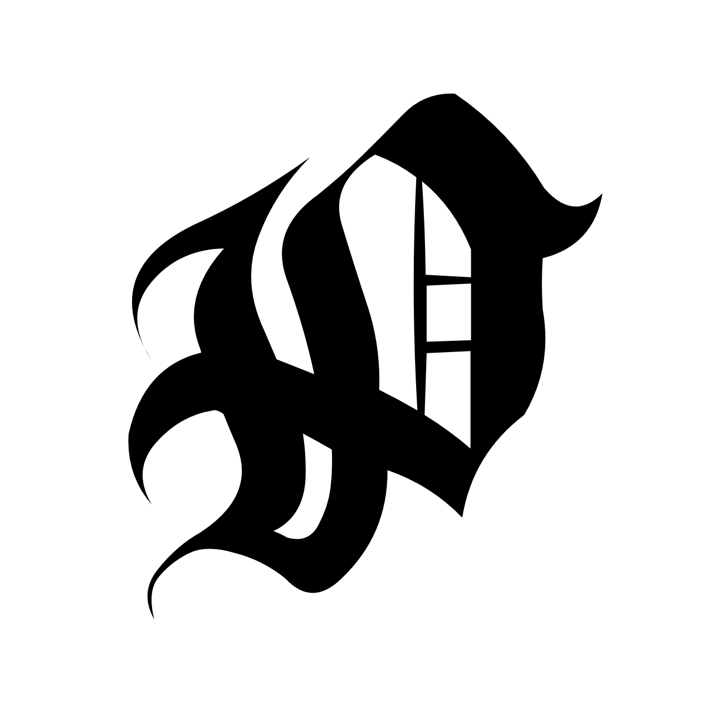

\# Presencia - Smart Attendance Tracker 📅

&#x20; 

Presencia is a modern, high-contrast offline attendance tracking application built with \*\*Kotlin\*\* and \*\*Jetpack Compose\*\*. It allows users to seamlessly manage their daily attendance for multiple subjects with an intuitive UI and visual analytics.

\## ✨ Features

\- \*\*Subject Management:\*\* Add, edit, or delete multiple subjects easily.

\- \*\*Visual Analytics:\*\* Real-time Donut Chart indicating attendance percentage.

\- \*\*Interactive Calendar:\*\* Mark 'Present' or 'Absent' directly on a built-in calendar view ranging from Jan 2026 to Dec 2077.

\- \*\*High Contrast Themes:\*\* Toggle between Pure White (🔆) and Pure Black (🌙) themes for optimal visibility and battery saving.

\- \*\*Offline Storage:\*\* All data is securely saved locally on the device using `SharedPreferences` and `Gson`.

\- \*\*Bulk Actions:\*\* Select all subjects to delete their data in one go.

\## 📸 Screenshots

| Light Theme \& Add Subject | Dark Theme | Calendar View |

| :---: | :---: | :---: |

|  |  |  |

\*(Note: The above screenshots demonstrate the pure high-contrast UI and the interactive calendar functionality.)\*

\## 🚀 Tech Stack

\- \*\*Language:\*\* Kotlin

\- \*\*UI Toolkit:\*\* Jetpack Compose (Material 3)

\- \*\*Architecture:\*\* MVVM (Model-View-ViewModel)

\- \*\*Local Database:\*\* SharedPreferences + Gson (Google JSON)

\- \*\*Icons:\*\* Material Icons Extended

\## 📂 Project Structure Overview

\- `/app/src/` - Contains the main source code (Kotlin UI \& Logic).

\- `/assets/` - Contains app branding and icons.

\- `/screenshots/` - Contains UI previews.

\- `/apk/` - Contains the latest compiled Android package (`Presencia.apk`) ready for installation.

\## 📥 Installation

You can directly install the app on your Android device without building it from the source code:

1\. Navigate to the `apk/` folder in this repository.

2\. Download the `Presencia.apk` file.

3\. Transfer it to your Android device and install it (make sure "Install from Unknown Sources" is enabled).

\## 🛠️ Build from Source

If you want to clone and build the project yourself:

1\. Clone this repository to your local machine.

2\. Open the project in \*\*Android Studio\*\*.

3\. Let Gradle sync the dependencies (requires Gson and Material Icons Extended).

4\. Click on \*\*Run\*\* to build and deploy the app to an emulator or a connected device.

\## 🛡️ License

This project is created for educational and personal utility purposes.

